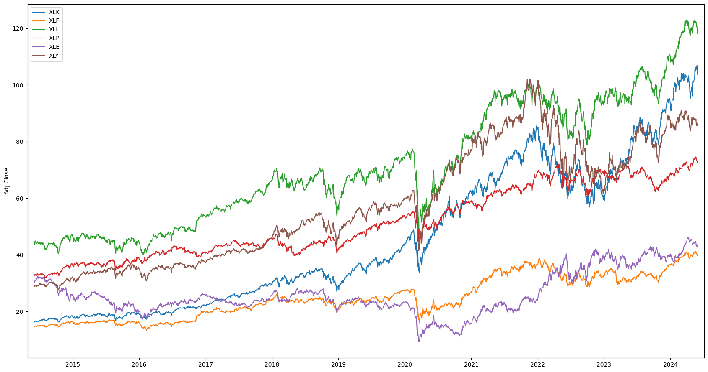
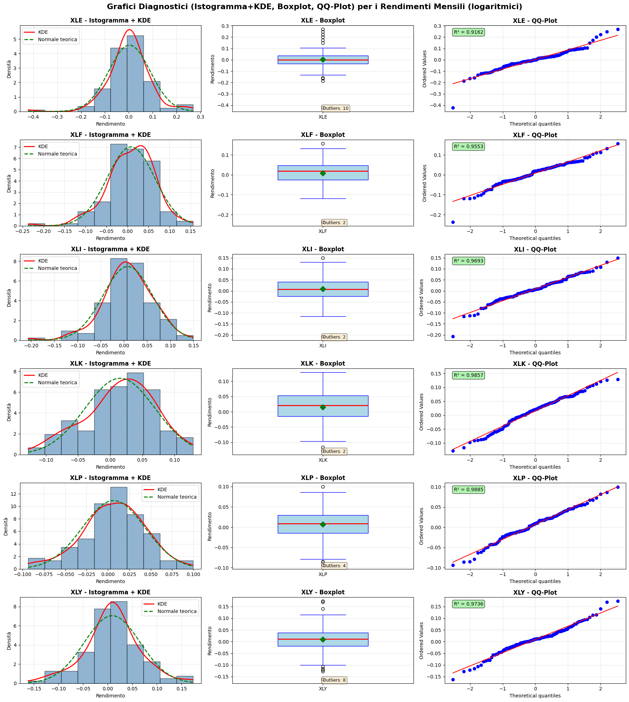
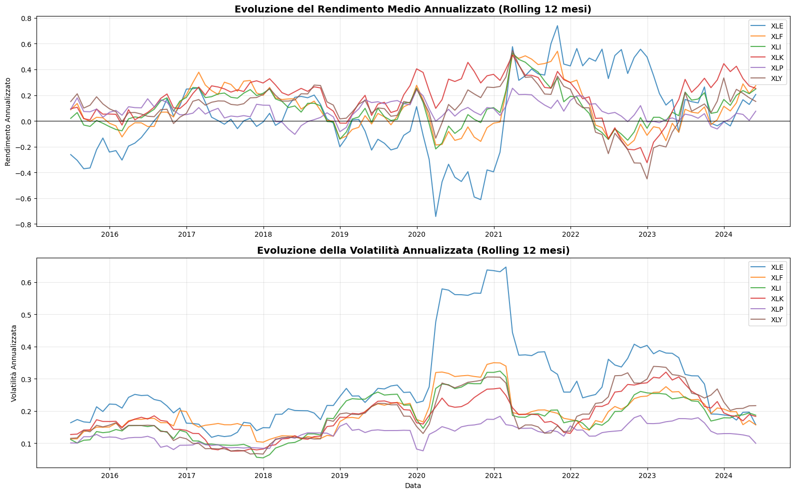
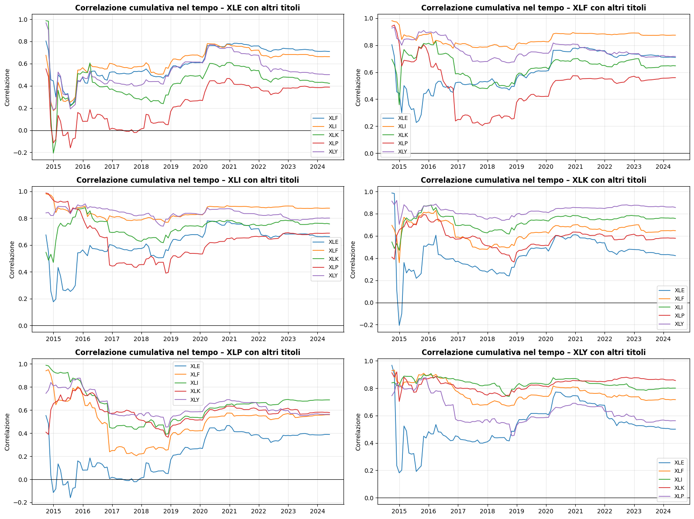
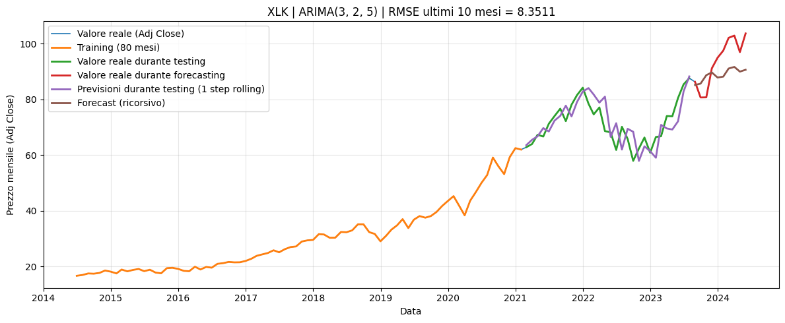
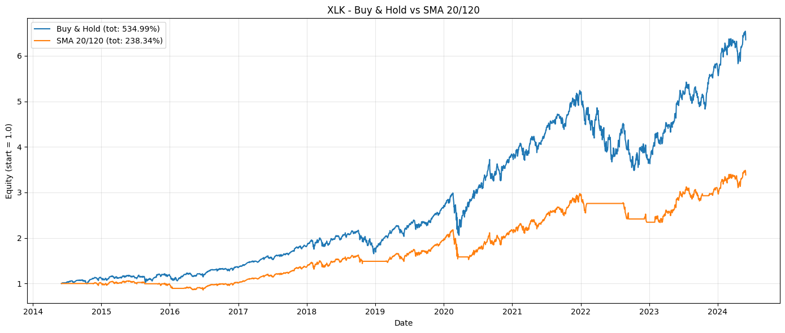
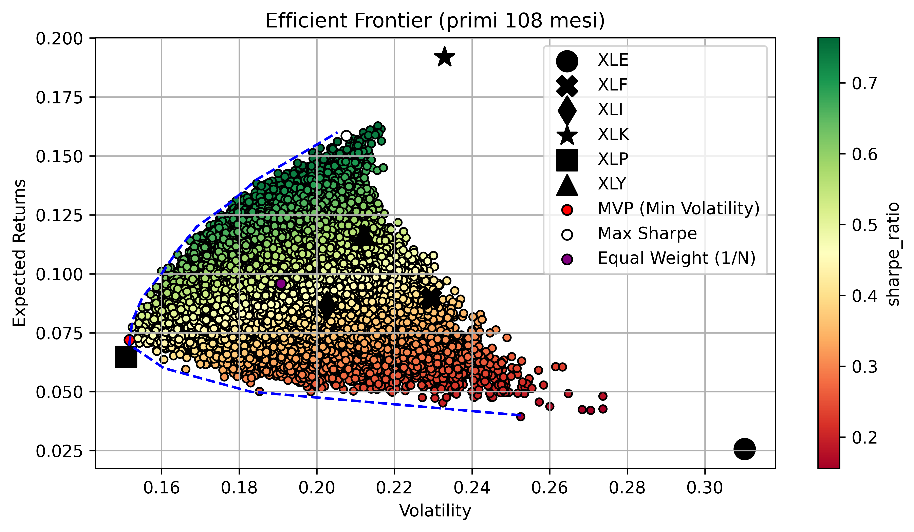
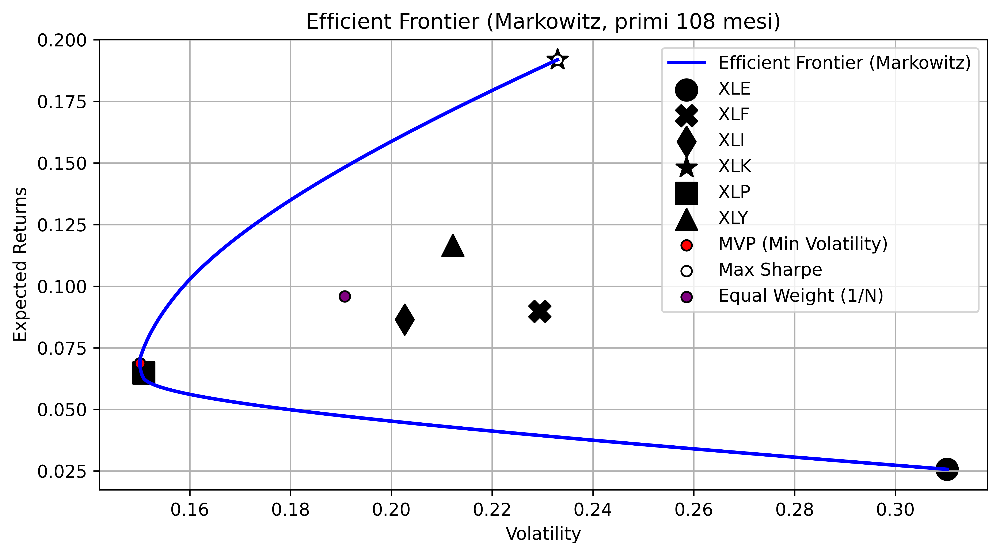

# Business Intelligence for Financial Services: S&P 500 Sector ETF Analysis

## Overview

This project analyzes six S&P 500 sector ETFs with Python, covering price evolution, monthly returns, risk and correlation structure, ARIMA forecasting, CAPM/Fama-French factor exposure, trading strategy simulation with backtesting, and mean-variance portfolio construction.

## Objectives

The objectives come from `Project Brief.pdf`, which is the assignment and project requirements. The implemented notebook addresses the following requested tasks:

- Acquire daily financial data for at least six S&P 500 sector ETFs.
- Compute and visualize prices, cumulative returns, CAGR, simple returns, and log returns.
- Produce descriptive statistics, return diagnostics, volatility analysis, covariance, and correlation analysis.
- Estimate ARIMA forecasting models for each ETF.
- Estimate ETF beta against the S&P 500, compute CAPM expected returns, and run Fama-French three-factor regressions.
- Backtest a technical trading strategy and compare it with Buy & Hold.
- Build optimal portfolios using Monte Carlo simulation and Markowitz mean-variance optimization.

`Presentation BISF.pdf` is the presentation of the project.

## Dataset Description

The project uses six S&P 500 sector ETFs and the S&P 500 index benchmark. The notebook downloads prices from Yahoo Finance with `yfinance`, using `start = "2014-05-31"` and `end = "2024-05-31"`.

| Ticker | Instrument | Sector represented |
|---|---|---|
| XLE | Energy Select Sector SPDR Fund | Energy |
| XLF | Financial Select Sector SPDR Fund | Financials |
| XLI | Industrial Select Sector SPDR Fund | Industrials |
| XLK | Technology Select Sector SPDR Fund | Technology |
| XLP | Consumer Staples Select Sector SPDR Fund | Consumer staples |
| XLY | Consumer Discretionary Select Sector SPDR Fund | Consumer discretionary |
| ^GSPC | S&P 500 index | Market benchmark |

Each daily price file contains `Date`, `Open`, `High`, `Low`, `Close`, `Adj Close`, `Volume`, and `Dividends`.




*Caption: Adjusted close prices for the six sector ETFs over the 2014-2024 sample; XLK and XLI show the strongest price appreciation, while XLE remains the weakest long-run performer.*

## Methodology

### Data Acquisition

The notebook `main/bisf.ipynb` downloads daily OHLCV data for `XLK`, `XLF`, `XLI`, `XLP`, `XLE`, `XLY`, and `^GSPC` through `yfinance.download`. Each ticker is saved as a separate CSV file under `main/data/`.

### Data Preprocessing

The implementation resamples ETF adjusted closes to month-end using resample("ME").last(). Monthly simple returns are computed via percentage change, and monthly log returns are computed as:

```text
log(P_t / P_{t-1})
```


### Exploratory Data Analysis (EDA)

The EDA covers cumulative return, CAGR, monthly simple returns, and monthly log returns.
| Ticker | Cumulative return | CAGR |
|---|---:|---:|
| XLE | 41.73% | 3.55% |
| XLF | 174.15% | 10.62% |
| XLI | 171.29% | 10.50% |
| XLK | 534.99% | 20.32% |
| XLP | 121.15% | 8.27% |
| XLY | 198.79% | 11.58% |

### Statistical Analysis

The notebook computes annualized mean log return, annual variance, annual standard deviation, skewness, and kurtosis for each ETF's monthly log returns. It also builds diagnostic plots with histogram plus KDE, boxplot, and QQ plot for each ETF.



*Caption: Distribution diagnostics for monthly log returns; XLE has the largest number of outliers and the weakest QQ-plot fit, while XLP is closest to normality among the analyzed ETFs.*

Key descriptive outputs from the notebook:

| Ticker | Annual mean log return | Annual std. dev. | Skewness | Kurtosis | Outliers | QQ R2 |
|---|---:|---:|---:|---:|---:|---:|
| XLE | 0.0296 | 0.3018 | -0.5032 | 4.9457 | 10 | 0.9162 |
| XLF | 0.0996 | 0.1968 | -0.7444 | 2.3468 | 2 | 0.9553 |
| XLI | 0.1006 | 0.1854 | -0.4948 | 1.7607 | 2 | 0.9693 |
| XLK | 0.1844 | 0.1886 | -0.3624 | -0.1944 | 2 | 0.9857 |
| XLP | 0.0800 | 0.1267 | -0.2805 | 0.2991 | 4 | 0.9885 |
| XLY | 0.1088 | 0.1962 | -0.0410 | 1.1254 | 8 | 0.9736 |

The rolling analysis uses a 12-month window to track annualized return and volatility over time.



*Caption: Rolling 12-month annualized return and volatility; volatility spikes around the COVID-19 shock, with XLE showing the strongest instability.*

The covariance and correlation analysis uses monthly log returns. The strongest ETF correlation is between `XLF` and `XLI` at `0.8744`; the weakest is between `XLE` and `XLP` at `0.3883`.



*Caption: Cumulative correlations among ETFs; early values are unstable because few observations are available, while correlations become more stable and generally higher after 2020.*

### Forecasting

The notebook implements ARIMA forecasting for each ETF using monthly adjusted close prices. For each 120-month ETF series:

- first 80 months are used as the training set;
- next 30 months are used for one-step rolling testing, updating the history with actual values;
- final 10 months are forecast recursively, updating the history with forecasts rather than actuals;
- ARIMA order `(p, d, q)` is selected by grid search over `p = 0..5`, `d = 0..2`, and `q = 0..5`, minimizing AIC;
- the final 10-month RMSE is shown in each forecast plot title.



*Caption: Example ARIMA forecast for XLK, the strongest-performing ETF in the dataset; the plot separates training, rolling test predictions, final recursive forecasts, and actual final values.*

Forecast plots are generated for all six ETFs: `XLY`, `XLP`, `XLK`, `XLI`, `XLF`, and `XLE`. The notebook does not export a separate numeric table of ARIMA orders or RMSE values.

### CAPM and Fama-French Analysis

Daily adjusted-close returns are used to estimate each ETF's beta against the S&P 500 (`^GSPC`):

| ETF | Beta |
|---|---:|
| XLE | 1.0706 |
| XLF | 1.0673 |
| XLI | 0.9866 |
| XLK | 1.1966 |
| XLP | 0.6223 |
| XLY | 1.0609 |

The CAPM expected return calculation uses notebook assumptions of expected market return `0.08` and risk-free rate `0.04`. Under those assumptions, XLK has the highest CAPM expected annual return (`8.78%`), while XLP has the lowest (`6.49%`).

The Fama-French regressions use monthly ETF returns joined with `mkt`, `smb`, `hml`, and `rf` factors from `ff3.csv`. The regression formula is:

```text
excess_rtn ~ mkt + smb + hml
```

Implemented factor results show positive market exposure for all ETFs. XLE has the strongest positive HML exposure, XLK and XLY have negative HML exposure, and XLP has the lowest market-factor coefficient and the lowest regression R-squared among the six ETFs.

### Trading Strategy Backtest

The notebook implements a simple moving-average crossover strategy for each ETF using daily adjusted close prices:

- fast moving average: 20 trading days;
- slow moving average: 120 trading days;
- position is long when `SMA20 > SMA120`;
- the signal is shifted by one day before applying returns;
- the strategy is compared with Buy & Hold equity growth from the same starting value.



*Caption: XLK Buy & Hold versus the SMA 20/120 strategy; Buy & Hold returns 534.99%, while the SMA strategy returns 238.34%.*

The same backtest is generated for all six ETFs. In the implemented sample, Buy & Hold beats the SMA 20/120 strategy for every ETF:

| ETF | Buy & Hold total return | SMA 20/120 total return |
|---|---:|---:|
| XLE | 41.73% | 14.59% |
| XLF | 174.15% | 89.06% |
| XLI | 171.29% | 41.86% |
| XLK | 534.99% | 238.34% |
| XLP | 121.15% | 17.12% |
| XLY | 198.79% | 93.66% |

### Portfolio Analysis

The notebook constructs mean-variance portfolios over the first 108 months of data using daily `Close` prices.

Two approaches are implemented:

- Monte Carlo simulation with 500,000 randomly weighted long-only portfolios.
- Markowitz optimization using constrained minimization, with weights bounded between `0` and `1`.



*Caption: Monte Carlo efficient frontier from 500,000 simulated long-only portfolios over the first 108 months; the plot highlights simulated MVP, simulated maximum Sharpe, equal weight, and individual ETF positions.*

Monte Carlo portfolio results:

| Portfolio | Return | Volatility | Sharpe ratio | Main weights |
|---|---:|---:|---:|---|
| Minimum volatility | 7.20% | 15.17% | 0.4745 | XLP 78.62%, XLY 10.36%, XLE 4.88% |
| Maximum Sharpe | 15.86% | 20.76% | 0.7639 | XLK 69.54%, XLF 9.85%, XLP 9.78%, XLI 8.23% |
| Equal weight | 9.59% | 19.08% | 0.5025 | 16.67% in each ETF |

The beta of the Monte Carlo maximum-Sharpe portfolio against the S&P 500 is `1.1060`.



*Caption: Markowitz efficient frontier over the first 108 months; the analytical maximum-Sharpe solution concentrates fully in XLK, while the minimum-volatility solution is mostly XLP.*

Markowitz portfolio results:

| Portfolio | Return | Volatility | Sharpe ratio | Main weights |
|---|---:|---:|---:|---|
| Minimum volatility | 6.87% | 15.01% | 0.4577 | XLP 90.40%, XLY 8.43%, XLE 1.17% |
| Maximum Sharpe | 19.19% | 23.30% | 0.8237 | XLK 100.00% |
| Equal weight | 9.59% | 19.08% | 0.5025 | 16.67% in each ETF |

The beta of the Markowitz maximum-Sharpe portfolio against the S&P 500 is `1.1910`.

## Technologies Used

- Python
- Jupyter Notebook
- pandas
- NumPy
- Matplotlib
- SciPy (`scipy.stats`, `scipy.optimize.minimize`)
- Statsmodels (`ARIMA`, OLS regression)
- yfinance

## Results Summary

- XLK is the strongest ETF in the sample, with `534.99%` cumulative return and `20.32%` CAGR.
- XLE is the weakest ETF by return, with `41.73%` cumulative return and `3.55%` CAGR, and it has the highest annualized volatility (`30.18%`).
- XLP has the lowest annualized volatility (`12.67%`) and is the closest to normality by the notebook's QQ-plot distance measure.
- Correlations are positive across all ETF pairs; `XLF` and `XLI` are the most correlated pair, while `XLE` and `XLP` are the least correlated pair.
- Beta estimates show XLK as the most market-sensitive ETF (`1.1966`) and XLP as the least market-sensitive ETF (`0.6223`).
- The SMA 20/120 strategy underperforms Buy & Hold for all six ETFs in this sample.
- Both portfolio methods identify XLP-heavy allocations as minimum-volatility portfolios.
- The Markowitz maximum-Sharpe portfolio allocates 100% to XLK, reflecting XLK's dominant historical return in the first 108-month optimization window.

## Project Structure

```text
.
|-- Project Brief.pdf
|-- Presentation BISF.pdf
|-- main/
|   |-- bisf.ipynb
|   |-- data/
|       |-- XLE_daily.csv
|       |-- XLF_daily.csv
|       |-- XLI_daily.csv
|       |-- XLK_daily.csv
|       |-- XLP_daily.csv
|       |-- XLY_daily.csv
|       |-- ^GSPC_daily.csv
|       |-- ff3.csv
```
